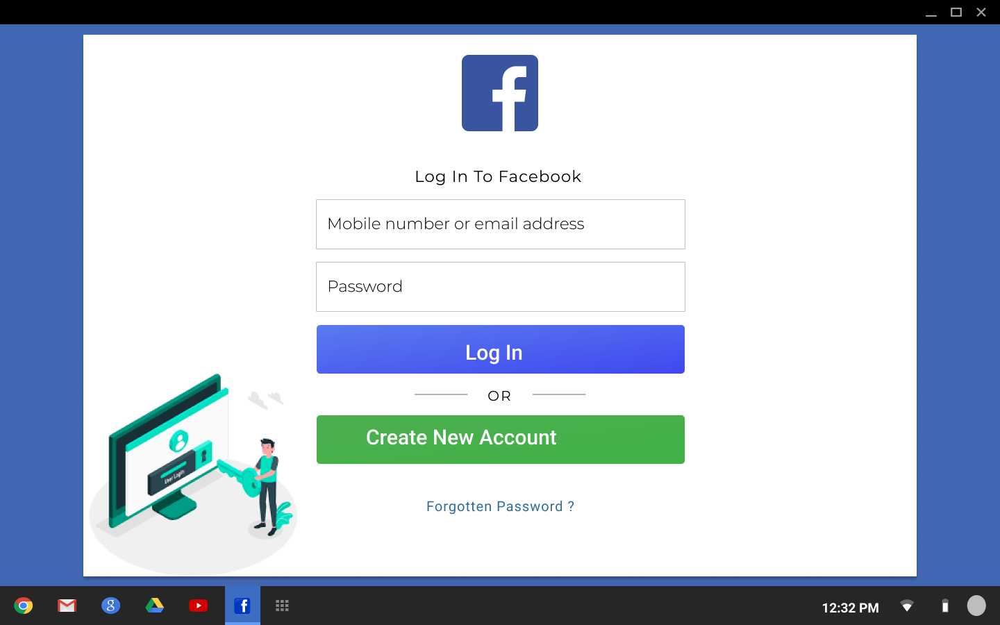
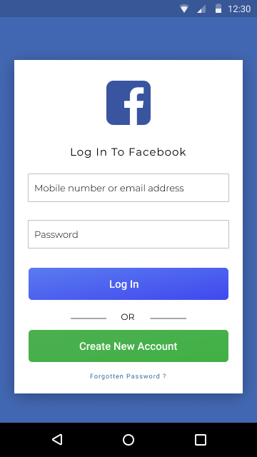

## Steps in Building the Login page
 


1. Looking at the figma design: two fonts are used. Montserrat and Roboto. Montserrat is used for the body, and Roboto is used for the buttons. And their weight matters to, so I head to fonts.google.com and bring in the fonts.

2. Setup my typography (Although I would have prefer Bootstrap rather do it for me).

3. Two colors are used in the UI, blue and green. But Blue dominates the most, and Green somehow complement it. So I will set Blue as my ```primary color``` and the Green as my ```secondary color```. Using CSS variable would have been great but I don't wanna use something that might not be support in all Browsers.

4. I look through the UI to define reusable CSS classes of common elements I can deduce: like the white container, the Buttons, posiitoning, padding, etc.

5. I have sort of defined reusable classes, now I want to define the most crucial ones: Inputs and Buttons.

6. And that is all. **You are tasked with designing the rest of the pages, add the OR text with line**.